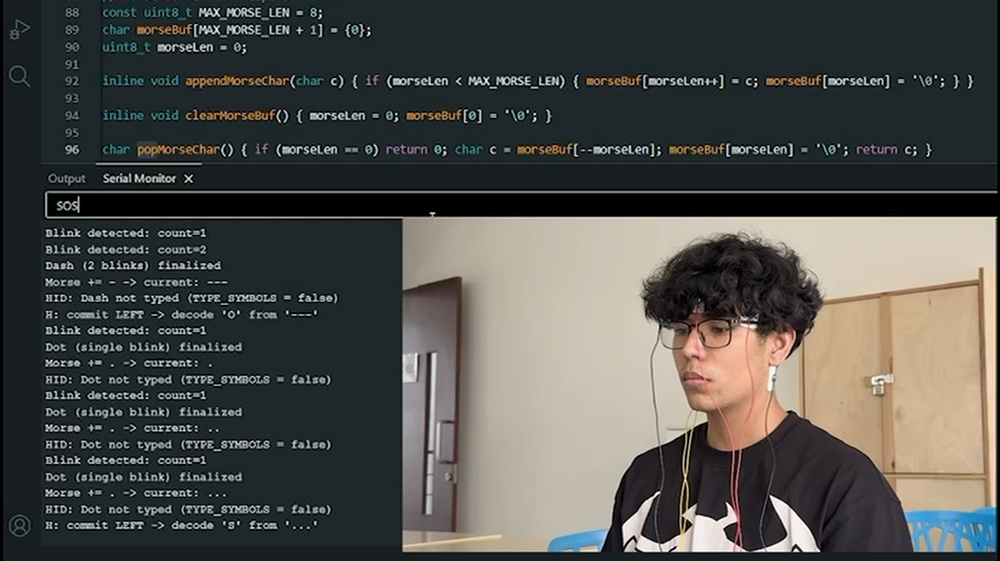

# BlinkMorse

BlinkMorse is an eye-movement (EOG) based assistive interface that converts blinks into Morse code and outputs text using Arduino HID.

## How It Works

- Single blink → `.`
- Double blink → `-`
- Triple blink → Clear buffer
- Horizontal left → Commit character
- Horizontal right → Space

Signals are acquired using EEG hardware (used here for EOG capture) and processed in real-time on an Arduino R4.

## Hardware

- Arduino R4 
- BioAmp EXG Pill (Upside Down Labs)
- A0 → Vertical channel (blinks)
- A1 → Horizontal channel (left/right)

## Demo

[Watch Demo](Demo.mp4)

## License

MIT
